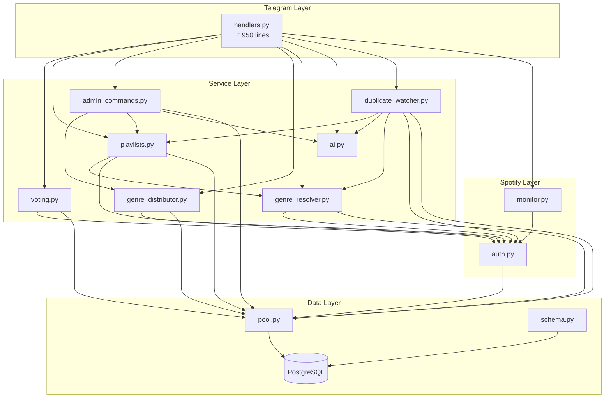

# Modules & Services

## Architecture Diagram



## Module Details

### Bot Layer

| File | Responsibility |
|------|----------------|
| `app/bot/handlers.py` | ALL command handlers, callback handlers, session state, bot startup |
| `app/config.py` | Pydantic settings (env vars) |
| `app/main.py` | Entry point, pool + schema init |

**Problem:** handlers.py is a monolith (~1950 lines). All session state lives in module-level globals.

### Service Layer

| File | Responsibility | Depends On |
|------|----------------|------------|
| `app/services/voting.py` | Vote recording, threshold calculation, track removal, skip | auth.py, pool |
| `app/services/playlists.py` | Playlist import, duplicate check, create/reschedule | auth.py, genre_resolver.py, pool |
| `app/services/admin_commands.py` | Post-session commands: distribute, recap, close, create_next, dbinfo | genre_distributor.py, playlists.py, ai.py, pool |
| `app/services/genre_distributor.py` | Genre classification (GENRE_MAP), distribute tracks to genre playlists | auth.py, pool |
| `app/services/genre_resolver.py` | Resolve track genre via Spotify artist API, backfill | auth.py, pool |
| `app/services/ai.py` | OpenAI: track facts, recap, teaser | openai |
| `app/services/duplicate_watcher.py` | Background: poll playlists, detect duplicates, auto-remove, generate AI facts | playlists.py, ai.py, genre_resolver.py, auth.py, pool |

### Spotify Layer

| File | Responsibility |
|------|----------------|
| `app/spotify/auth.py` | OAuth flow, token refresh/persistence, get_spotify() client |
| `app/spotify/monitor.py` | Playback polling (4s), track change/pause/resume detection |

### Data Layer

| File | Responsibility |
|------|----------------|
| `app/db/pool.py` | asyncpg connection pool (min=2, max=5) |
| `app/db/schema.py` | Table definitions, migrations (v1, v2) |

## In-Memory State (handlers.py globals)

```python
_active_session_id: int | None
_active_playlist_id: str | None
_current_session_track_id: int | None
_participants: list[int]              # telegram_ids
_track_messages: dict[int, list[tuple[int, int]]]  # session_track_id -> [(chat_id, msg_id)]
_played_track_ids: set[str]           # guard: don't re-vote same track
_skip_in_progress: set[int]           # guard: race condition on skip
_cached_pre_recap: str | None         # pre-generated teaser
_session_message: tuple[int, int] | None
_waiting_theme: bool
```

**Recovered on restart** from `sessions` WHERE status='active'.

## Background Tasks

| Task | Trigger | Interval |
|------|---------|----------|
| DuplicateWatcher | Bot startup | Variable: 1h (Tue-Wed), 5h (Mon), 12h (Thu-Sun) |
| SpotifyMonitor | `/session` start | 4 seconds polling |
| AI Facts Generator | DuplicateWatcher cycle | Per-track, for upcoming playlist |
