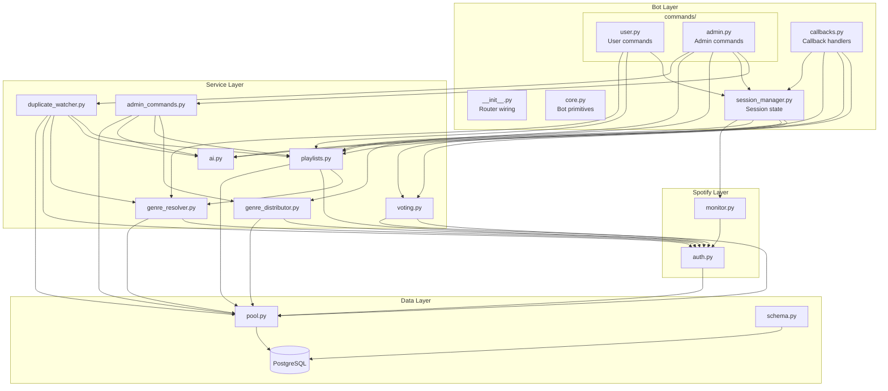

# Modules & Services

## Architecture Diagram



## Module Details

### Bot Layer

| File | Lines | Responsibility |
|------|-------|----------------|
| `app/bot/__init__.py` | 139 | Router wiring, `setup_bot()` |
| `app/bot/core.py` | 138 | `bot`, `dp`, `pool`, `is_admin`, `is_registered`, `extract_spotify_id`, decorators (`@require_admin`, `@require_registered`, `@require_admin_callback`), message helpers (`send`, `reply`, `send_photo`, `reply_photo`, `edit_text`, `edit_caption`), `safe_int`, `parse_turdom_number` |
| `app/bot/session_manager.py` | 535 | `SessionManager` singleton: all session state, `on_track_change`, `end_session`, `check_session_complete`, `finalize_track_card`, `update_vote_buttons`, `recover`, `send_recap_carousel`, `cache_pre_recap_teaser` |
| `app/bot/callbacks.py` | 401 | All `callback_query` handlers: voting, skip, regen_facts, approve/deny, session control, recap carousel, playlist creation, history pagination |
| `app/bot/commands/user.py` | 697 | `/start`, `/reg`, `/next`, `/get`, `/genres`, `/check`, `/stats`, `/mystats`, `/history`, `/join`, `/leave`, `/secret` |
| `app/bot/commands/admin.py` | 575 | `/auth`, `/session`, `/preview`, `/reschedule`, `/scan`, `/import`, `/import_all`, `/distribute`, `/recap`, `/close_playlist`, `/create_next`, `/health`, `/dbinfo`, `/backfill_genres` |
| `app/config.py` | — | Pydantic settings (env vars) |
| `app/main.py` | — | Entry point, pool + schema init |

### Service Layer

| File | Responsibility | Depends On |
|------|----------------|------------|
| `app/services/voting.py` | Vote recording, threshold calculation, track removal, skip | auth.py, pool |
| `app/services/playlists.py` | Playlist import, duplicate check, create/reschedule | auth.py, genre_resolver.py, pool |
| `app/services/admin_commands.py` | Post-session commands: distribute, recap, close, create_next, dbinfo | genre_distributor.py, playlists.py, ai.py, pool |
| `app/services/genre_distributor.py` | Genre classification (GENRE_MAP), distribute tracks to genre playlists | auth.py, pool |
| `app/services/genre_resolver.py` | Resolve track genre via Spotify artist API, backfill | auth.py, pool |
| `app/services/ai.py` | OpenAI: track facts, recap, teaser | openai |
| `app/services/duplicate_watcher.py` | Background: poll playlists, detect duplicates, auto-remove, generate AI facts | playlists.py, ai.py, genre_resolver.py, auth.py, pool |

### Spotify Layer

| File | Responsibility |
|------|----------------|
| `app/spotify/auth.py` | OAuth flow, token refresh/persistence, get_spotify() client |
| `app/spotify/monitor.py` | Playback polling (4s), track change/pause/resume detection |

### Data Layer

| File | Responsibility |
|------|----------------|
| `app/db/pool.py` | asyncpg connection pool (min=2, max=5) |
| `app/db/schema.py` | Table definitions, versioned migrations via `schema_version` table (32 migrations) |

## In-Memory State (SessionManager)

`SessionManager` is a singleton class (`session` instance) in `session_manager.py`. All session state is encapsulated:

```python
session_id: int | None
playlist_id: str | None
current_session_track_id: int | None
participants: set[int]                    # telegram_ids
track_messages: dict[int, list[tuple[int, int]]]  # session_track_id -> [(chat_id, msg_id)]
played_track_ids: set[str]               # guard: don't re-vote same track
skip_in_progress: set[int]               # guard: race condition on skip
cached_pre_recap: str | None             # pre-generated teaser
session_message: tuple[int, int] | None
waiting_theme: bool
```

**Recovered on restart** from `sessions` WHERE status='active' via `SessionManager.recover()`.

## Background Tasks

| Task | Trigger | Interval |
|------|---------|----------|
| DuplicateWatcher | Bot startup | Variable: 1h (Tue-Wed), 5h (Mon), 12h (Thu-Sun) |
| SpotifyMonitor | `/session` start | 4 seconds polling |
| AI Facts Generator | DuplicateWatcher cycle | Per-track, for upcoming playlist |
