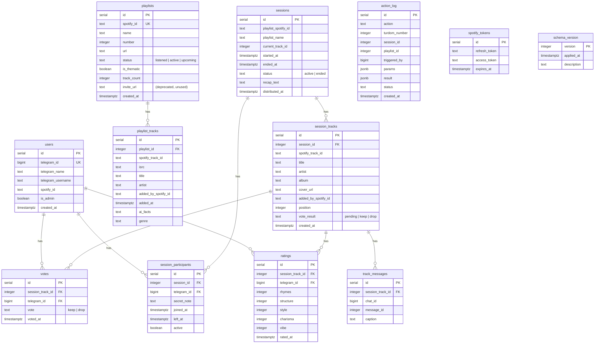

# Database Schema

## ER Diagram

## Key Relationships

| Relationship | Type | Join Key |
|---|---|---|
| playlists → playlist_tracks | 1:N | playlist_tracks.playlist_id |
| sessions → session_tracks | 1:N | session_tracks.session_id |
| sessions → session_participants | 1:N | session_participants.session_id |
| session_tracks → votes | 1:N | votes.session_track_id |
| session_tracks → ratings | 1:N | ratings.session_track_id |
| playlists → sessions | 1:N | sessions.playlist_spotify_id = playlists.spotify_id |
| session_tracks → track_messages | 1:N | track_messages.session_track_id |
| users → session_participants | 1:N FK | session_participants.telegram_id → users.telegram_id (ON DELETE CASCADE) |
| users → votes | 1:N FK | votes.telegram_id → users.telegram_id (ON DELETE CASCADE) |
| users → ratings | 1:N FK | ratings.telegram_id → users.telegram_id (ON DELETE CASCADE) |
| session_tracks ↔ playlist_tracks | Implicit | spotify_track_id (no FK) |
| users ↔ playlist_tracks | Implicit | added_by_spotify_id = users.spotify_id (no FK) |

## Notes

- **3 foreign keys on telegram_id** — `session_participants`, `votes`, `ratings` reference `users.telegram_id` (ON DELETE CASCADE)
- **18 indexes** on frequently queried columns (Phase 4)
- **Versioned migrations** tracked in `schema_version` (32 migrations)
- `playlist_tracks` unique constraint: `(playlist_id, spotify_track_id)` — same track can exist in multiple playlists
- `votes` unique constraint: `(session_track_id, telegram_id)` — one vote per user per track
- `session_tracks` ↔ `playlist_tracks` joined via `spotify_track_id` — used in distribute to get genre
- `genre` column added via migration v2, backfilled via `genre_resolver.py`
