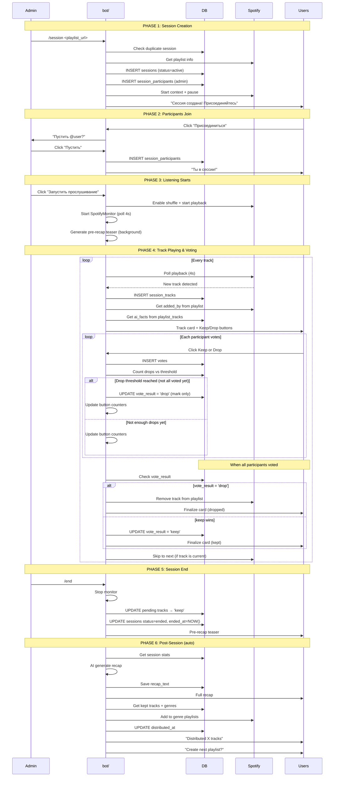
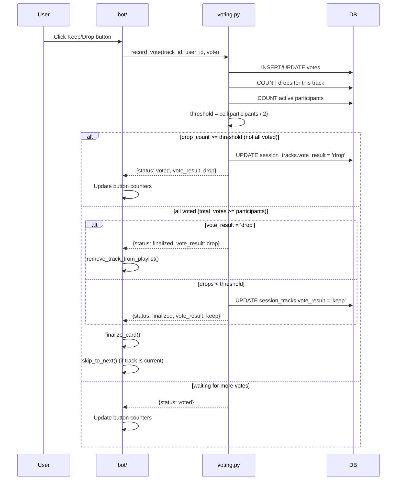
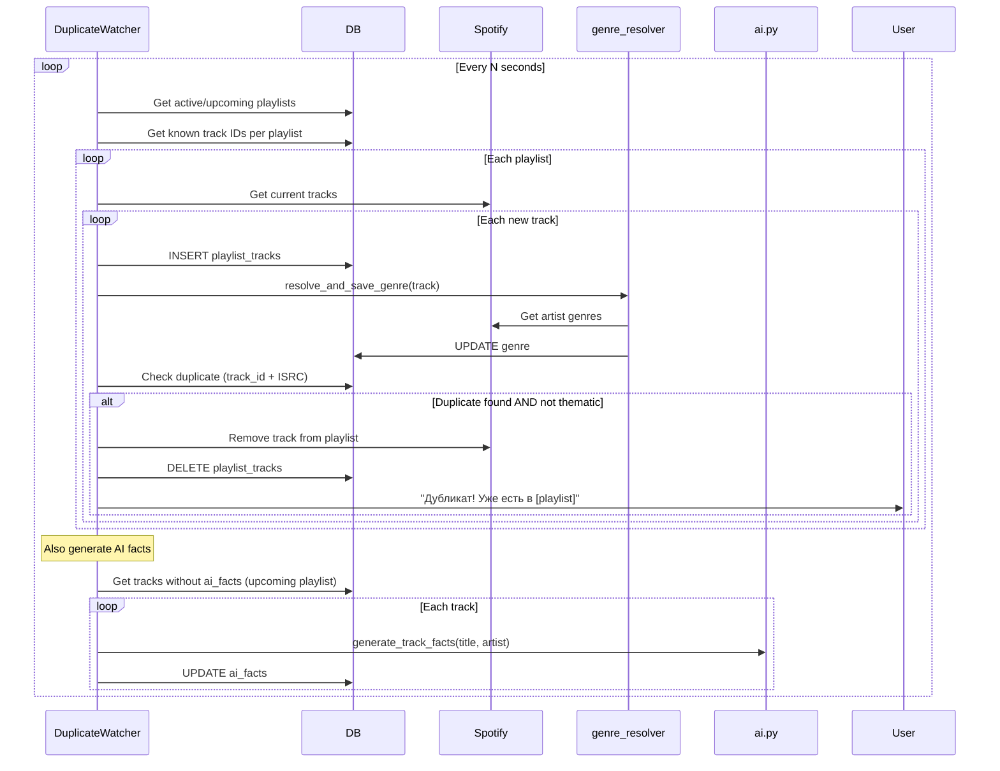
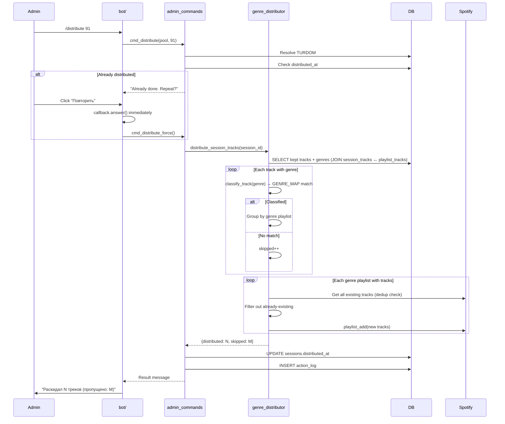
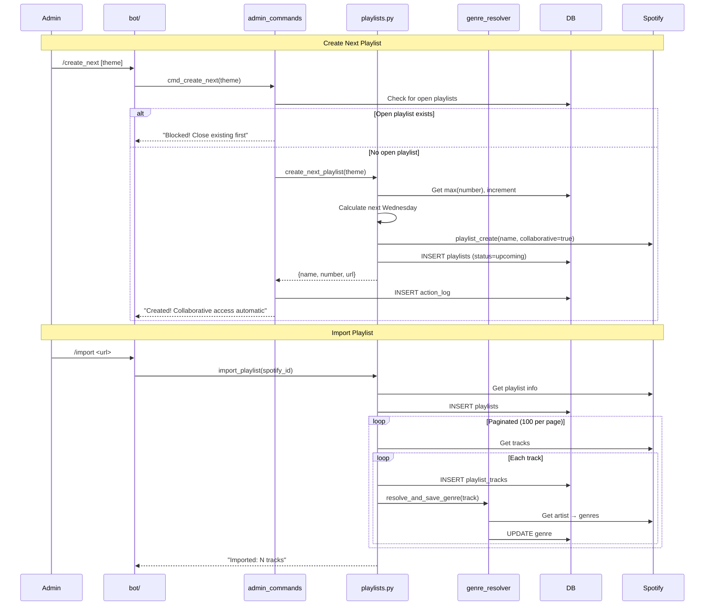
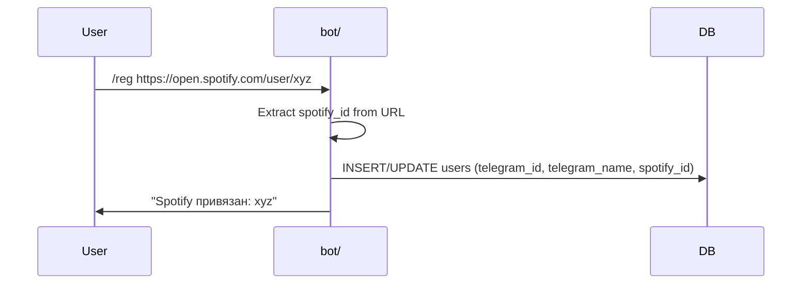
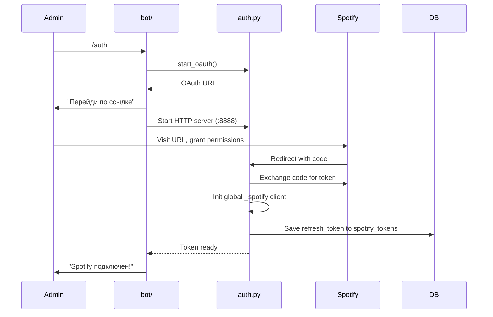
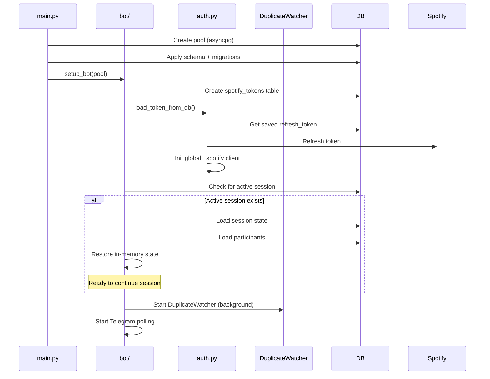

# Main Flows

## 1. Session Lifecycle (Full)

## 2. Vote Logic

## 3. Duplicate Detection (Background)

## 4. Genre Distribution

## 5. Playlist Creation & Import

## 6. User Registration

## 7. Spotify Auth (Admin)

## 8. Bot Startup & Recovery

