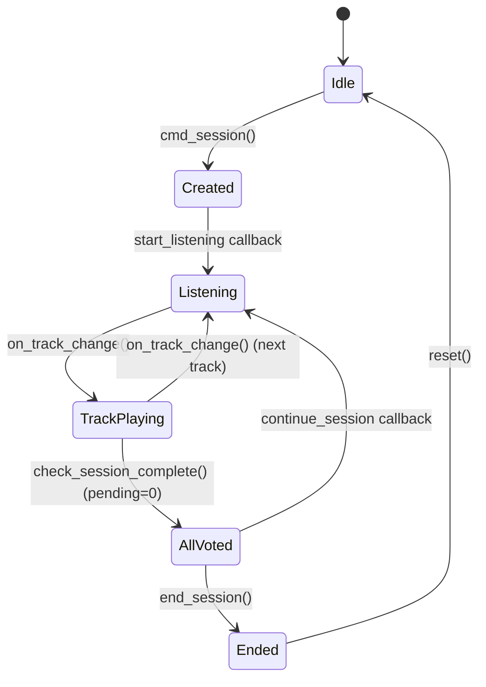

# Session State & Lifecycle

## SessionManager class

Singleton instance `session` in `app/bot/session_manager.py`. Holds all in-memory state for the active listening session.

### State attributes

| Attribute | Type | Purpose |
|-----------|------|---------|
| `active_session_id` | `int \| None` | DB session PK |
| `active_playlist_id` | `str \| None` | Spotify playlist ID |
| `current_session_track_id` | `int \| None` | DB PK of the currently playing session_track |
| `participants` | `set[int]` | Telegram user IDs |
| `track_messages` | `dict[int, list[tuple[int, int, str]]]` | `session_track_id` → list of `(chat_id, msg_id, caption)` |
| `played_track_ids` | `set[str]` | Spotify track IDs already played (skip-guard) |
| `cached_pre_recap` | `str \| None` | AI-generated teaser shown before recap |
| `skip_in_progress` | `set[int]` | session_track_ids currently being skipped (double-skip guard) |
| `session_message` | `tuple[int, int] \| None` | `(chat_id, msg_id)` of the "session created" message |
| `waiting_secret_clarification` | `dict[int, dict]` | Per-user pending secret playlist clarification |
| `session_end_prompted` | `bool` | Whether "all voted" prompt was already sent |
| `waiting_theme` | `bool` | Whether bot is awaiting theme input for thematic playlist |

All attributes are initialized by `reset()` which is called from `__init__` and after `end_session`.

## State Lifecycle

**Key transitions:**

- **Created → Listening**: admin presses "Start listening" button; `SpotifyMonitor` starts polling
- **TrackPlaying → AllVoted**: triggered when `pending=0` in `session_tracks`; playback is paused
- **AllVoted → Listening**: admin presses "Continue"; playback resumes, monitor keeps polling
- **AllVoted → Ended**: admin presses "End session"; recap generated, genre distribution runs, `reset()` clears state

## Persistence — DB vs In-Memory

### Persisted to DB

| Data | Table |
|------|-------|
| Session status, current_track_id | `sessions` |
| Participants | `session_participants` |
| Tracks played & vote results | `session_tracks` |
| Sent message references | `track_messages` |
| Individual votes | `votes` |

### In-memory only (lost on restart)

| Attribute | Impact if lost |
|-----------|---------------|
| `skip_in_progress` | Minor — skip guard resets, worst case a double-skip |
| `cached_pre_recap` | Minor — falls back to default teaser text |
| `session_message` | Minor — "session created" message stops updating participant count |
| `waiting_secret_clarification` | Minor — user re-triggers the command |
| `session_end_prompted` | Minor — "all voted" prompt may fire again |
| `waiting_theme` | Minor — user re-enters theme |

## Recovery

On bot restart, `recover()` restores state from DB:

1. Finds the latest `sessions` row with `status = 'active'`
2. Loads `active_session_id`, `active_playlist_id`, `current_session_track_id`
3. Loads `participants` from `session_participants WHERE active = TRUE`
4. Loads `played_track_ids` from `session_tracks`
5. Loads `track_messages` from `track_messages` joined with `session_tracks`
6. Restarts `SpotifyMonitor` with the playlist ID

**Not recovered** (acceptable — minor UX regression): `skip_in_progress`, `session_end_prompted`, `waiting_theme`, `cached_pre_recap`, `session_message`, `waiting_secret_clarification`.

## Concurrency

- **`participants`** is a `set` — duplicate `add()` calls are idempotent
- **`skip_in_progress`** guards against double-skip: track ID is added before async skip, removed after completion
- **Vote threshold** uses DB `COUNT(*)` query, not in-memory state — safe under concurrent votes
- **`session_end_prompted`** flag prevents duplicate "all voted" prompts when multiple votes land simultaneously
